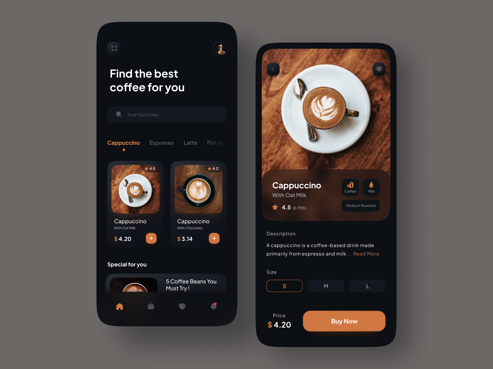
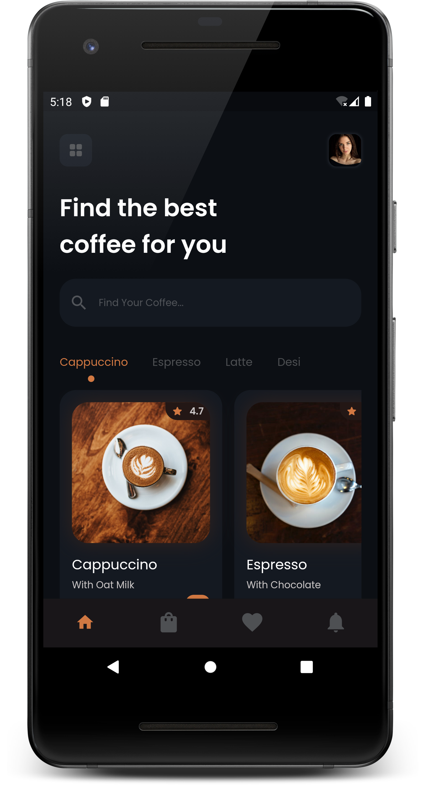
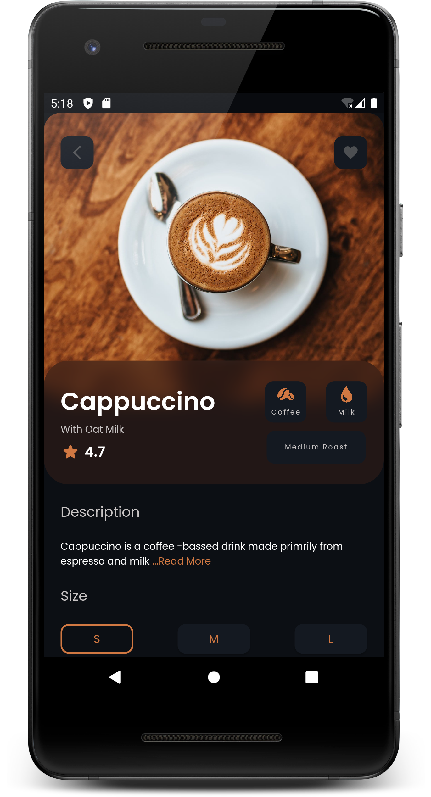

# SigmaMenuDemo App UI

## Table of Contents

- [Design](#design)
- [Screenshots](#screenshots)
- [License](#license)

## Design

## Screenshots

<table>
  <tr>
    <td>
Home Screen
</td>
    <td>
Detail Screen
</td>
    
  </tr>
  <tr>
    <td valign="top"></td>
    <td valign="top"></td>   
  </tr>
 </table>

## License

- **[MIT license](https://github.com/zyllus17/doctor-app-ui/blob/master/LICENSE)**
